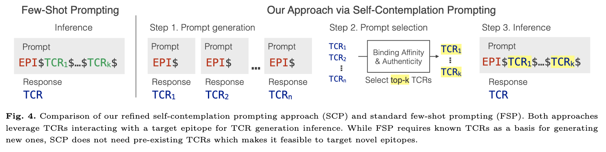
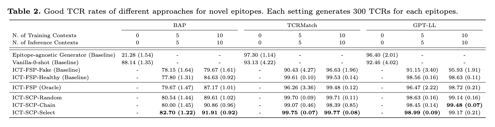

# Self-Contemplating In-Context Learning Enhances T Cell Receptor Generation for Novel Epitopes

This repository contains the official implementation of [**TCRGen**](https://www.biorxiv.org/content/biorxiv/early/2025/01/28/2025.01.27.634873.full.pdf), a generative model leveraging **in-context learning (ICL)** to design **T cell receptors (TCRs)** for unseen epitopes.


## 📜 Abstract

Computational design of T cell receptors (TCRs) that bind to epitopes holds the potential to revolutionize targeted immunotherapy. However, computational design of TCRs for novel epitopes is challenging due to the scarcity of training data, and the absence of known cognate TCRs for novel epitopes. In this study, we aim to generate high-quality cognate TCRs particularly for **novel epitopes** with no known cognate TCRs, a problem that remains under-explored in the field. We propose to incorporate in-context learning, successfully used with large language models to perform new generative tasks, to the task of TCR generation for novel epitopes. By providing cognate TCRs as additional context, we enhance the model's ability to generate high-quality TCRs for novel epitopes. We first unlock the power of in-context learning by training a model to generate new TCRs based on both a target epitope and a small set of its cognate TCRs, so-called in-context training (ICT). We then self-generate its own TCR contexts based on a target epitope, as novel epitopes lack known binding TCRs, and use it as an inference prompt, referred to as self-contemplation prompting (SCP). Our experiments first demonstrate that aligning training and inference distribution by ICT is critical for effectively leveraging context TCRs. Subsequently, we show that providing context TCRs significantly improves TCR generation for novel epitopes. Furthermore, we show TCR generation using SCP-synthesized context TCRs achieves performance comparable to, and sometimes surpassing, ground-truth context TCRs, especially when combined with refined prompt selection based on binding affinity and authenticity metrics.

We evaluate the generated TCRs on:
1. **Amino acid-level** similarity to real TCRs  
2. **k-mer overlap** to ensure functional motifs  
3. **Binding affinity scores** to confirm epitope recognition  

📌 **Results:** TCRGen-k achieves **higher binding probability and higher sequence authenticity** compared to several baseline models.  

  

---

## 📄 Publication  

**Self-Contemplating In-Context Learning Enhances T Cell Receptor Generation for Novel Epitopes**  
[Pengfei Zhang](https://github.com/pzhang84)<sup>1</sup>, [Sonal Sujit Prabhu]<sup>1</sup>, [Gloria Grama]<sup>2</sup>, [Seojin Bang](http://seojinb.com/)<sup>3</sup>, [Heewook Lee](https://scai.engineering.asu.edu/faculty/computer-science-and-engineering/heewook-lee/)<sup>1</sup>  
<sup>1</sup>School of Computing and Augmented Intelligence, Arizona State University, Tempe, AZ 85281  
<sup>2</sup>School of Life Sciences, Arizona State University, Tempe, AZ 85281  
<sup>3</sup>Google DeepMind, Mountain View, CA 94043  

Accepted at **Machine Learning in Computational Biology (MLCB 2025)** — Poster presentation, to appear in **PMLR**.  

[📘 Paper](TBA) | [💻 Code](https://github.com/Lee-CBG/TCRGen) | [🧾 Poster (PDF)]()


## 📦 Installation

First, create a virtual environment (optional but recommended):
```bash
python3 -m venv tcrgen_env
source tcrgen_env/bin/activate  # For Mac/Linux
```

Then, install the required dependencies:
```bash
pip install torch==2.0.1 transformers==4.20.1
```


Ensure you have **Python 3.8+** installed.

---

## 🏋️‍♂️ Training the Generative Model

To train **TCRGen**, run:
```bash
python train.py
```


Examples for **TCR Generation**:
```bash
cd generation

# Vanilla-0-shot (Baseline)
python ict_vanilla.py --gpu_id 0 --gen_model 0 --temper 0.4 --out_of_sample True 

# ICT-FSP-Fake (Baseline)
python fsp_fake.py --gpu_id 0 --gen_model 10

# ICT-FSP-Healthy (Baseline)
python fsp_healthy.py --gpu_id 0 --gen_model 10

# ICT-FSP (Oracle)
python fsp_oracle.py --gpu_id 0 --gen_model 10

# ICT-SCP-Chain
python scp_chain.py --gpu_id 0 --gen_model 10

# ICT-SCP-Random
python scp.py --gpu_id 0 --gen_model 10 --scp_mode scp-random

# ICT-SCP-Select
python scp.py --gpu_id 0 --gen_model 10 --scp_mode scp-select

```


---

## 🔍 Evaluation

To evaluate the quality of generated sequences, run:
```bash
bash eval/run_eval.sh
```

This script computes:
- Sequence authenticity
- Binding affinity scores
- k-mer overlap  

The quality of generated sequences can be also evaluated using bit scores and blosum scores


### 🧬 Bit Score (BLAST)

```
python eval/bit_score.py
```

- **What is it?**  
  A Bit Score is a statistical measure used in BLAST to indicate the quality of an alignment between two sequences.

- **Key Features:**
  - Derived from the raw alignment score and normalized.
  - Higher scores = more significant alignments.
  - Accounts for both match quality and alignment length.
  - Useful when comparing across multiple alignments or databases.

- **Usage in this project:**  
  Quantifies similarity between a natural TCR and all candidate TCRs using `blastp`.

  - Stores the generated TCRs and naturally binding TCRs in FASTA file format, which acts as a valid input to BLASTP command
  - Creates a database from the naturally binding TCRs
  - Compares the generated TCRs ( also known as query sequences ) against the natural TCR database
  - BLASTp was configured to report only high-confidence local alignments (E-value < 0.001)

---

### 🧬 BLOSUM Score

```
python eval/blosum_score.py
```

- **What is it?**  
  BLOSUM (BLOcks SUbstitution Matrix) scores reflect how often one amino acid is substituted for another in evolutionarily conserved regions.

- **How it works:**
  - Each amino acid pair (e.g., A↔L, W↔F) is given a score based on observed substitution frequency.
  - This project uses **BLOSUM62**, the most commonly applied matrix.

- **Usage in this project:**  
  Performs pairwise scoring of TCR sequences (known TCRs binding to a particular epitope and TCRs generated by the model) to evaluate diversity within a single epitope’s TCRs using Biopython package.
  - For every pair of known binding TCRs to an epitope and TCRs generated by the model, we calculate blosum score using local alignment
  - For each model generated TCR, we store the maximum,minimum and the average score


---

## 🎯 Pre-trained Models  

Pre-trained weights will be provided soon.  


📌 **Expected Input:** Epitope sequences  
📌 **Expected Output:** Predicted TCR sequences with binding potential  

---

## 📊 Results & Benchmarking  

  

📌 *Higher scores indicate better performance.*  

---

## 📜 Citation

If you find **TCRGen** useful for your research, please cite our work:

```
@article{zhang2025self,
  title={Self-Contemplating In-Context Learning Enhances T Cell Receptor Generation for Novel Epitopes},
  author={Zhang, Pengfei and Bang, Seojin and Lee, Heewook},
  journal={bioRxiv},
  pages={2025--01},
  year={2025},
  publisher={Cold Spring Harbor Laboratory}
}
```

---

## 🤝 Contributing

We welcome contributions! Please submit a pull request or open an issue if you encounter any problems.
